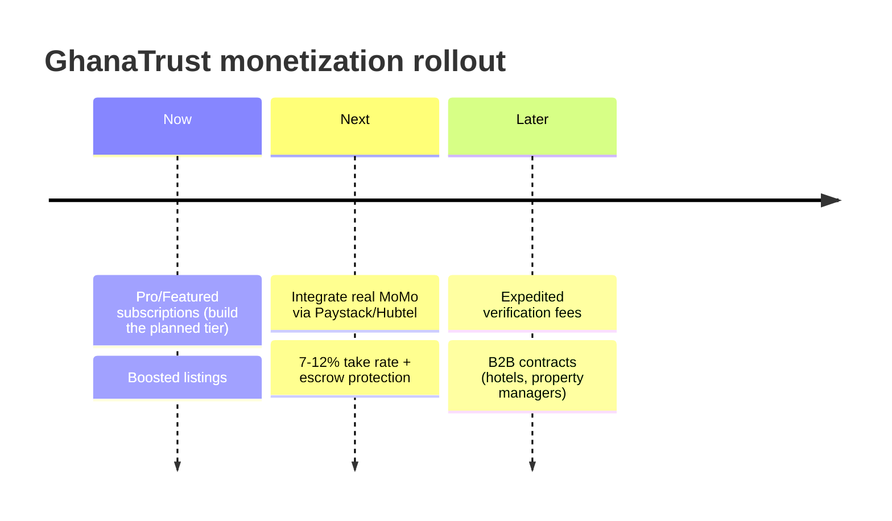

Given what's already built (booking lifecycle, payments model, trust scores, verification, disputes), here are the revenue streams that fit GhanaTrust best, ranked by how quickly you can turn them on:

## 1. Provider subscriptions — your fastest stream (already designed)
This is the Pro/Premium tier we scoped earlier. Providers pay monthly for visibility, customers never pay:

| Tier | Price (GHS/mo) | Benefits |
|---|---|---|
| Free | 0 | Listed, bookable, basic profile |
| Pro | ~50 | Search ranking boost, Pro badge, analytics, unlimited service listings |
| Featured | ~120 | Homepage spotlight, category top slot, priority in search |

Providers in Ghana already spend on Facebook ads and word-of-mouth; this converts that budget into predictable MRR for you. Implementation is mostly done on paper: `subscriptionTier` + `subscriptionExpiresAt` on `Provider`, sort boost in the provider search, badge in `ProviderCard`.

## 2. Commission on platform-paid bookings (take rate)
Your `Payment` model already supports MOBILE_MONEY/CARD — route real money through Paystack, Flutterwave, or Hubtel (all support MTN MoMo + cards) and take **7–12%** of completed bookings. The catch: cash bookings bypass you entirely. The fix is making in-app payment *worth it*: escrow-style protection (money released after completion), automatic receipts, and dispute leverage — "paid through GhanaTrust" gives customers recourse, which is your entire brand promise.

## 3. Featured listings & boosts
Micro-version of subscriptions: pay GHS 10–20 to boost a single service to the top of its category for 7 days. Low commitment for providers who won't subscribe yet — good entry funnel into tier 1.

## 4. Premium verification
You already built the verification workflow. Keep identity verification **free** (it protects marketplace trust — never tax safety), but offer **expedited review (48h vs 2 weeks)** for a one-off GHS 25–50.

## What to avoid early
- **Customer-side fees** (booking fees, "priority support") — kills liquidity before you have density
- **Pay-per-lead** (Thumbtack model) — providers resent it and it only works at massive volume
- Monetizing before one city has real supply/demand density — free until providers complain they're getting too much work, *then* charge

## Recommended sequence

Stream 1 needs zero payment infrastructure if you collect via MoMo prompt/manually at first — it's pure schema + UI + search-sort work, which is exactly the plan sitting in the backlog.

Want me to start building the Pro/Premium subscription tier now? It was already agreed as: schema → migrate → backend routes → provider dashboard UI → search boost.
